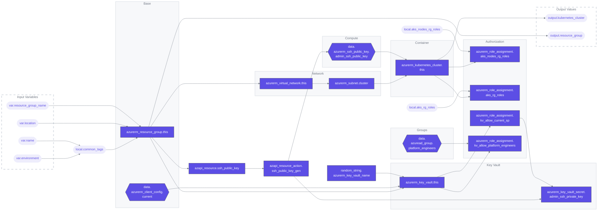

# Terraform Module for Azure Kubernetes Service (AKS) Cluster

## Overview

This Terraform module is designed to set up an Azure Kubernetes Service (AKS) cluster along with necessary networking and security components. It provides a straightforward approach to deploy a fully functional AKS cluster in Azure.

### Terraform Architecture

## Features

- **Azure Resource Group Creation:** Initiates a resource group for managing all related Azure resources.
- **Network Setup:** Establishes a Virtual Network and a dedicated Subnet for the AKS cluster.
- **Key Vault Setup:** Implements an Azure Key Vault for secure key management.
- **SSH Key Management:** Automates the generation and handling of SSH keys for secure cluster access.
- **Azure Kubernetes Service Deployment:** Configures and deploys the AKS cluster with customizable settings.
- **Role Assignments:** Sets up necessary role assignments for resource management within Azure.

## Prerequisites

For details on the required providers, refer to [01-providers.tf](01-providers.tf).

## Usage

A working example of how to use this module is provided in the `example` directory. This example illustrates a practical implementation of the module, offering a starting point for your deployment.

## Variables and Outputs

- **Variables:** For a list of configurable variables, see the [variables.tf](variables.tf) file.
- **Outputs:** To understand the output values that this module generates, refer to the [outputs.tf](outputs.tf) file.

## Workflows
| Name | Description |
|---|---|
| [terraform-ci.yaml](.github/workflows/terraform-ci.yaml) | A workflow for linting and auto-formatting Terraform code. Triggered by pushes to  `main` and `dev` branches or on pull requests, it consists of two jobs: `tflint` for lint checks, `format` for code formatting and submit a PR, and `tfmermaid` to update architecture graph and submit a PR. |
